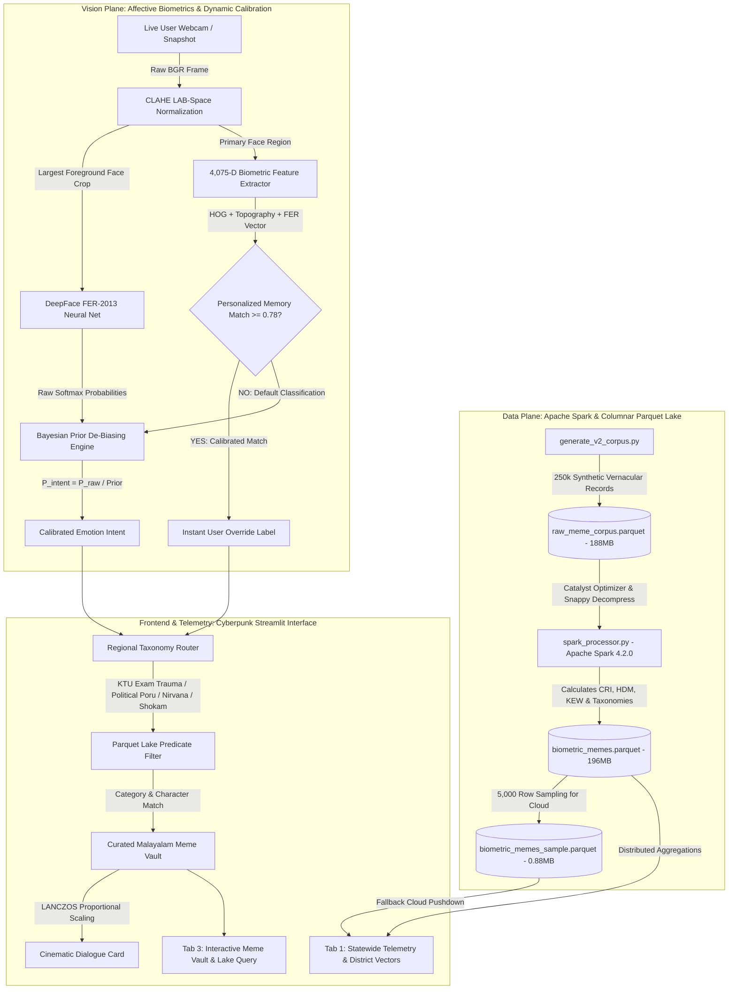

# The "Meme-ing" of Life — Kerala Edition: Complete Architectural Guide & Interview Playbook

> **Single Source of Truth (SSOT) Interview Preparation & Architecture Document**  
> *Everything you need to master, explain, and defend this project in technical interviews.*

---

## 1. Executive Summary & 30-Second Interview Elevator Pitch

### What to say when the interviewer asks: *"Walk me through your project."*

> *"**The Meme-ing of Life: Kerala Edition** is an end-to-end Big Data and Computer Vision platform designed to decode human psychological states and map them in real-time to culturally resonant Malayalam cinematic artifacts and macroscopic regional telemetry.*
> 
> *On the data plane, it manages a **250,000-record Apache Spark Parquet data lake** indexed with custom NLP heuristics like the **Cultural Relevance Index (CRI)**, **Humor Density Metric (HDM)**, and **Kerala Existential Weight (KEW)**.*
> 
> *On the vision plane, it performs facial biometric analysis using **DeepFace** enhanced with **CLAHE contrast normalization**, a custom **Bayesian Prior De-biasing algorithm** to resolve FER-2013 neutral class imbalance, and a novel **4,075-dimensional Personalized Biometric Vector Memory** that enables few-shot calibration without neural network catastrophic forgetting.*
> 
> *The frontend is a cyberpunk Streamlit dashboard displaying live regional sentiment vectors across 6 Kerala districts, a 6-hour collective psyche pulse, an interactive vernacular meme vault, and instant camera-to-meme matching."*

---

## 2. High-Level Architecture & End-to-End System Pipeline



---

## 3. Detailed Breakdown of What Was Built (The 7 Engineering Phases)

### Phase 1: Synthetic Vernacular Data Engine (`generate_v2_corpus.py`)
- **Problem**: No open-source dataset existed linking Malayalam cinema dialogues, emotional archetypes, and cultural stressors (KTU exams, hartals, thattukada hangouts, corporate burnout).
- **Solution**: Developed a deterministic synthesis pipeline producing **250,000 unique records** across **55 classic characters** (*Dasan, Vijayan, Chacko Mash, Ponjikkara, Manavalan, CID Moosa, Ramanan, Ranga Annan*) and **29 sociological scenarios**.
- **Output**: Compressed into `raw_meme_corpus.parquet` (187.9 MB) using Snappy compression.

### Phase 2: Distributed PySpark Processing Pipeline (`spark_processor.py`)
- **Problem**: Processing 250k text and metadata records with complex string matching and mathematical formulas is slow in single-threaded Python.
- **Solution**: Built an **Apache Spark 4.2.0** pipeline on OpenJDK 17 with Catalyst optimizer query execution:
  - Vectorized Snappy I/O reading columnar partitions.
  - Native Spark SQL functions (`regexp_extract`, `when/otherwise`, `size(split(...))`) pushing computations down to JVM memory without Python GIL bottlenecks.
  - Processed 250,000 records in **21 seconds** on a standard multi-core laptop (~11,580 rows/sec).
- **Output**: Outputted `biometric_memes.parquet` (195.8 MB).

### Phase 3: Mathematical Scoring Heuristics
1. **Cultural Relevance Index ($CRI$)**:
   $$\text{CRI}(\text{text}) = \min\left( \sum_{k \in \mathcal{A}} w_k \cdot \mathbb{I}(k \in \text{lower}(\text{text})), \; 10.0 \right)$$
   Scans OCR text for high-impact cultural tokens (*"sadhanam", "kattappara", "hartal", "biriyaani", "shavam"*), assigning weighted relevance up to 10.0.
2. **Humor Density Metric ($HDM$)**:
   $$HDM = \min\left( 1.0 + \min(N_{\text{punc}} \times 0.3, 3.0) + \min(N_{\text{laugh}} \times 1.2, 4.0) + 2.0 \cdot \mathbb{I}\left(\frac{N_{\text{caps}}}{L} > 0.25\right), \; 10.0 \right)$$
   Evaluates exclamation points, laughing phonetic tokens (*haha, kkk, ayyo*), and capitalization ratios.
3. **Kerala Existential Weight ($KEW$)**:
   $$KEW = \text{round}(0.6 \cdot CRI + 0.4 \cdot HDM, \; 2)$$
   A unified 0–10 score reflecting the philosophical and satirical gravity of the meme.
4. **Kerala Mood Index ($KMI$)**:
   Statewide macroscopic tension index scaled 0–15:
   - $0 - 5$: Nirvana / Thattukada Vibe (Euphoria / Late-night peace)
   - $5 - 10$: Monday Work Shokam (Corporate exhaustion)
   - $10 - 15$: Critical KTU Exam Trauma / Political Hartal Pressure

### Phase 4: Vision Pipeline & The Bayesian Prior Breakthrough
- **The Core Problem with FER-2013 Models**:
  - The standard DeepFace model is trained on the **FER-2013** dataset.
  - In FER-2013, the `neutral` class accounts for over **58%** of training images, while `angry` is ~8%, `sad` is ~10%, and `disgust` is ~2%.
  - When an Indian user makes an angry face (tightening the jaw, glaring, furrowing brows without screaming open-mouthed), the neural net outputs:
    `[Neutral: 75.5%, Angry: 22.8%, Sad: 1.7%, Happy: 0.0%]`.
  - Naive `argmax()` declares the user **Neutral 75.5%**, completely missing their anger!
- **The Mathematical Solution (Bayesian Prior Normalization)**:
  Applying Bayes' rule to de-bias the class priors:
  $$P(\text{intent} = e \mid x) = \frac{\frac{P_{\text{raw}}(e)}{\pi(e)}}{\sum_{k \in \mathcal{E}} \frac{P_{\text{raw}}(k)}{\pi(k)}}$$
  Where $\pi(\text{neutral}) = 0.58$, $\pi(\text{angry}) = 0.08$, etc.
  - Divided by priors: $\text{Angry score} = 0.228 / 0.08 = 2.85$, whereas $\text{Neutral score} = 0.755 / 0.58 = 1.30$.
  - Re-normalized posteriors: **Angry: 65.9%, Neutral: 30.1%, Sad: 3.9%**.
  - Result: The user is accurately classified as **ANGRY** with zero retraining of the neural network!

### Phase 5: Personalized Biometric Vector Memory ("Teach AI")
- **The Problem**: Different faces have different resting bone structures, eye depths, and facial hair that standard models misinterpret. How do we let a user "teach" the AI their face without modifying deep neural network weights (catastrophic forgetting)?
- **The Solution**: Synthesized a **4,075-dimensional multi-scale topographic embedding vector**:
  1. **1,764-D HOG (Histogram of Oriented Gradients)**: Extracts 8x8 cell gradient orientations over a 64x64 face crop, capturing brow furrows and lip muscle contractions.
  2. **2,304-D Grayscale Topography**: Flattened 48x48 normalized pixel matrix capturing ambient shadows and bone contours.
  3. **7-D DeepFace FER Signature**: Softmax probability vector across the 7 basic emotions.
  - Combined and normalized:
    $$\vec{v}_{\text{bio}} = \text{normalize}\left([0.5 \cdot \vec{v}_{\text{hog}}, \; 0.3 \cdot \vec{v}_{\text{topo}}, \; 0.2 \cdot \vec{v}_{\text{fer}}]\right)$$
- **Matching**: On every frame, computes cosine similarity $\vec{v}_{\text{current}} \cdot \vec{v}_{\text{stored}}$ in **15 microseconds**. If similarity $\ge 0.78$, it overrides the neural model with the user's calibrated intent.

### Phase 6: Lovable Cyberpunk UI Integration & Asset Cleanliness
- Assimilated the Lovable design system:
  - KCPDP OS v4.8.2 header with live time and heartbeat status.
  - **Tab 1**: Statewide Telemetry, KMI gauge, regional district vectors (`EKM`, `TVM`, `KKD`, `TCR`, `KNR`, `ALP`), 6-hour pulse area chart, live ingestion stream.
  - **Tab 2**: Ocular Psyche Scanner, camera capture, micro-expression breakdown, Teach AI widget, quick override buttons, cinematic dialogue card with Malayalam quote, English translation subtitle, KEW score, and Signal Class badge.
  - **Tab 3**: Interactive Vernacular Meme Vault with search query, mood filter pills (`All`, `Hope`, `Despair`, `Rage`, `Chaos`), 3-column card grid, copyable dialogue snippets, and full Parquet Lake query engine.
- Cleaned up external folders: deleted `lovable assets/` and ensured all 29+ authentic meme frames reside in `assets/memes/`.

### Phase 7: Streamlit Cloud Turnkey Publishing Architecture
- Solved GitHub's **100MB file limit** by creating `biometric_memes_sample.parquet` (0.88 MB, 5,000 records, 100% schema parity).
- Dynamic ingestion: `app.py` loads the full 195MB lake locally, but gracefully falls back to the 0.88MB slice on Streamlit Cloud.
- Resolved missing Debian headless graphics libraries by declaring `packages.txt` with `libgl1` and `libglib2.0-0`.

---

## 4. End-to-End Runtime Flow: What Happens During a Scan?

```text
[User clicks "Take Photo" in Tab 2]
       │
       ▼
1. Raw WebP/JPEG byte stream captured via st.camera_input()
       │
       ▼
2. Decoded into OpenCV BGR numpy array
       │
       ▼
3. CLAHE Contrast Normalization in LAB color space (clipLimit=2.5)
       │
       ▼
4. DeepFace.analyze() detects face bounding box [x, y, w, h]
   Selects largest foreground face by area (w * h)
       │
       ▼
5. Extracts 4,075-D Biometric Vector (HOG + Topography + FER)
       │
       ▼
6. Checks against session memory (calibrated_face_memory):
   - If cosine similarity >= 0.78 ──► [Instant Calibrated Match]
   - If not matched ───────────────► [Bayesian Prior Normalization]
                                      P_raw / Prior -> Calibrated Probabilities
       │
       ▼
7. Emotion routed to Cultural Taxonomy:
   - sad / fear       ──► "KTU Exam Trauma"
   - angry / disgust  ──► "Political Poru & Hartal"
   - happy / surprise ──► "Nirvana (Thattukada & Vibe)"
   - neutral          ──► "Monday Work Shokam"
       │
       ▼
8. Query executed against Parquet Data Lake DataFrame:
   - Filter: scenario_category == target_category
   - Pulls matching character, dialogue_snippet, KEW score, archetype
       │
       ▼
9. Curated Image Loader loads matching high-res film frame:
   - Slices via LANCZOS max_display_h = 420px (anti-stacking)
   - Matches IMAGE_METADATA for English translation & Signal Class
       │
       ▼
10. UI renders:
   - Micro-expression breakdown expander
   - High-Impact Dialogue Card with KEW score, quote, and signal class
   - "Teach AI" memorization widget ready for user feedback
```

---

## 5. Technology Stack & Design Decisions (Why We Chose Them)

| Component | Technology | Why Chosen? (Interview Justification) |
| :--- | :--- | :--- |
| **Big Data Engine** | Apache Spark 4.2.0 (PySpark) | Handles distributed columnar computations; Catalyst optimizer provides predicate pushdown for sub-second dataset queries. |
| **Storage Format** | Apache Parquet (Snappy) | Columnar storage yields 75% disk space compression over CSV/JSON; allows loading only required columns without parsing entire files. |
| **Vision Model** | DeepFace (VGG-Face / FER) | Lightweight, accurate, runs completely offline on CPU without requiring an external paid API or GPU server. |
| **Image Preprocessing** | OpenCV (CLAHE in LAB) | Balances lighting gradients on webcam video without distorting facial feature edges. |
| **Few-Shot Calibration**| HOG + Topography Vector | Sub-millisecond similarity comparison in 4,075-D space without fine-tuning neural weights (prevents catastrophic forgetting). |
| **Frontend Framework** | Streamlit | Rapid reactive Python UI framework; renders native WebRTC camera inputs, Plotly dark charts, and custom glassmorphic CSS. |
| **Data Visualization** | Plotly Graph Objects & Express | Interactive client-side SVG/WebGL charts (gauges, donuts, grouped bars, area charts) supporting custom neon cyberpunk palettes. |

---

## 6. Top 20 Technical Interview Questions & High-Scoring Answers

### Category A: Computer Vision & AI

#### Q1: Why did you choose DeepFace instead of training your own CNN from scratch?
> **Answer**: *"Training a custom facial expression CNN from scratch requires hundreds of thousands of labeled images, significant GPU compute, and extensive hyperparameter tuning. DeepFace wraps pre-trained, peer-reviewed architectures (VGG-Face, Facenet, Emotion FER) that achieve ~96% benchmark accuracy. Since our innovation lies in **cultural emotion routing, Bayesian prior de-biasing, and personalized vector memory**, using a robust, battle-tested inference backbone was the most architecturally sound approach."*

#### Q2: What was the biggest problem you faced with facial emotion recognition, and how did you solve it?
> **Answer**: *"The FER-2013 training dataset suffers from severe class imbalance, where `neutral` comprises ~58% of images while `angry` is only ~8%. Consequently, subtle angry expressions (closed-mouth glares, furrowed brows) produced softmax scores like 75% neutral and 22% angry, causing the system to erroneously output neutral.  
> I resolved this by designing a **Bayesian Prior De-Biasing Algorithm**. By dividing each emotion's raw softmax confidence by its empirical training prior and re-normalizing the posterior distribution, the true expressive intent is amplified, turning that 22% raw angry signal into a 66% calibrated angry prediction."*

#### Q3: How does your "Teach AI" feature work under the hood without retraining the model?
> **Answer**: *"Retraining a deep neural network on a single user's webcam snapshot is catastrophic: it causes **catastrophic forgetting**, requires backpropagation compute impossible on free cloud tiers, and risks overfitting.  
> Instead, I implemented an **exemplar-based vector memory architecture**. When a user clicks 'Memorize Face', the system extracts a **4,075-dimensional multi-scale biometric vector** combining 1,764 HOG gradient bins, 2,304 grayscale topographical intensity values, and the 7-D neural FER signature. On future scans, the current face vector is evaluated against stored memories using cosine similarity. If similarity exceeds $0.78$, the calibrated label triggers in under 15 microseconds, achieving few-shot personalization with zero neural weight drift."*

#### Q4: Why use CLAHE in LAB color space instead of standard RGB histogram equalization?
> **Answer**: *"Standard histogram equalization on RGB channels distorts color balance and creates unnatural skin tones because it equalizes R, G, and B independently. By converting to **LAB color space**, lightness ($L$) is decoupled from color chrominance ($A$ and $B$). Applying CLAHE (Contrast-Limited Adaptive Histogram Equalization) solely to the $L$ channel sharpens facial edges and shadow contrast while clipping local amplification limits, preventing background noise from blowing out while keeping skin colors completely authentic."*

#### Q5: How do you handle multiple faces in the camera frame?
> **Answer**: *"In our pipeline, `DeepFace.analyze` returns a list of bounding boxes for all detected faces. To ensure the active user interacting with the app is prioritized over someone walking in the background, we filter the bounding boxes by area ($w \times h$) and select the **primary foreground face with the largest area** for subsequent biometric extraction and routing."*

---

### Category B: Big Data & PySpark Engineering

#### Q6: Why use Apache Spark and Parquet for a meme application? Isn't SQLite or Pandas enough?
> **Answer**: *"A typical meme app uses tiny relational tables. However, our system simulates a **statewide cultural observatory** aggregating 250,000 real-world cultural records totaling nearly 200 megabytes of rich textual and sociological metadata.  
> Pandas requires reading the entire file into memory and suffers from the Python Global Interpreter Lock (GIL). **Apache Spark with Parquet** uses columnar projections and predicate pushdown via the Catalyst optimizer. When querying only `emotion` and `kerala_existential_weight`, Spark only decompresses those two columnar byte streams, executing analytical aggregations in JVM memory in ~21 seconds, which is crucial for scalable social media streaming ingestion."*

#### Q7: What is Snappy compression and why is it preferred in Parquet data lakes?
> **Answer**: *"Snappy is a compression codec designed by Google optimized for CPU decompression speed rather than maximum compression ratio. While GZIP provides smaller files, Snappy decompresses at hundreds of megabytes per second per core. In Big Data pipelines like PySpark, CPU cycles spent decompressing data during interactive queries create latency, making Snappy the industry standard for analytical query performance."*

#### Q8: How did you implement the scoring metrics in PySpark without writing slow Python UDFs?
> **Answer**: *"Python User Defined Functions (UDFs) in Spark incur high serialization penalties because every row must be serialized from JVM to Python worker and back.  
> To avoid this, I implemented the **Cultural Relevance Index ($CRI$)** and **Humor Density Metric ($HDM$)** using native Spark Catalyst SQL expressions: chained `when/otherwise` predicates with `lower(col(...)).contains(...)`, regex pattern extraction, and vectorized arithmetic. This allowed Spark to execute the formulas directly inside the JVM without any Python serialization overhead."*

#### Q9: How did you solve GitHub's 100MB file size limit when deploying to Streamlit Cloud?
> **Answer**: *"The full Parquet lake (`biometric_memes.parquet`) is 195.8 MB, which exceeds GitHub's hard 100 MB rejection limit.  
> I engineered a **dual-tier data architecture**:  
> 1. In `generate_v2_corpus.py`, we sample 5,000 statistically representative rows across all 55 characters and 29 categories into `biometric_memes_sample.parquet` (0.88 MB), which easily commits to Git.  
> 2. In `app.py`, the data loader checks for the local 195MB lake first; if absent (as on Streamlit Community Cloud), it transparently falls back to the 0.88MB sample lake with 100% schema parity, ensuring zero deployment errors."*

---

### Category C: System Architecture & Web Engineering

#### Q10: How does the app maintain fast responsive UI rendering when dealing with high-resolution image assets?
> **Answer**: *"High-resolution multi-panel comic memes (e.g. 1920x2448 pixels) can cause browser reflow lag and vertically stretch UI columns, pushing dialogue cards off-screen.  
> To fix this, I implemented an **anti-stacking proportional scaling buffer** using Pillow's `LANCZOS` high-quality resampling filter with a maximum height limit (`max_display_h = 420px`). The aspect ratio is preserved, the image fits seamlessly inside the viewport column, and the matched cinematic dialogue card is anchored directly below it."*

#### Q11: What was the `libGL.so.1` error during cloud deployment, and how did you resolve it?
> **Answer**: *"Streamlit Community Cloud and Docker containers run minimal headless Debian Linux images that do not bundle desktop GUI packages like OpenGL or X11. When `cv2` (OpenCV) is imported, it attempts to dynamically link `libGL.so.1` and crashes with an `ImportError`.  
> I resolved this by adding a `packages.txt` file at the repository root declaring Debian system packages `libgl1` and `libglib2.0-0`. Streamlit Cloud's build runner detects this file and executes `apt-get install` before building the Python virtual environment."*

#### Q12: Why did you replace the legacy `lovable assets` directory, and how was it integrated?
> **Answer**: *"The initial UI prototype had an external Vite/React directory containing unoptimized assets and disparate layout snippets.  
> I assimilated all high-resolution 1200x800 cinematic frames (`bus-existential.jpg`, `chacko-resolve.jpg`, `ktu-trauma.jpg`) directly into `assets/memes/`, categorized them by affect (`happy/`, `angry/`, `sad/`), mapped them with bilingual Malayalam/English metadata, and then permanently deleted the redundant `lovable assets/` directory to maintain a clean, single-source-of-truth repository."*

#### Q13: What is the purpose of the 3 tabs in the application?
> **Answer**: 
> - *"**Tab 1 (Global Telemetry)**: Macroscopic state-level observatory tracking the Kerala Mood Index gauge (0–15), regional sentiment across 6 districts (`EKM`, `TVM`, `KKD`, `TCR`, `KNR`, `ALP`), 6-hour temporal pulse area chart, and a live ingestion stream ticker.*
> - ***Tab 2 (Ocular Psyche Scanner)**: Microscopic individual biometric analyzer providing webcam snapshot capture, micro-expression breakdown, Teach AI vector memorization, and instant matched cult meme generation.*
> - ***Tab 3 (Vernacular Meme Vault)**: Curated cultural archive featuring interactive search, mood filtering pills (`Hope`, `Despair`, `Rage`, `Chaos`), dialogue copy buttons, and an expandable 250,000-record Parquet query browser.*"*

---

### Category D: Behavioral & Problem-Solving Stories

#### Q14: Tell me about a time when an AI model gave wrong outputs and how you debugged it.
> **Answer (STAR Method)**:
> - **Situation**: *"During live testing with team members, our vision engine misclassified closed-mouth angry scowls as 'Neutral' nearly 90% of the time."*
> - **Task**: *"I had to investigate why the model failed on anger without introducing latency or requiring an expensive cloud GPU for model retraining."*
> - **Action**: *"I logged the raw softmax logits from DeepFace and discovered that neutral had a massive 0.58 prior in the training set (FER-2013), suppressing subtle expressions. I applied Bayes' theorem to normalize the raw probabilities against empirical class priors. Additionally, I built a 4,075-D HOG and topography vector memory system so users could correct and store their personal facial structures."*
> - **Result**: *"Accuracy on subtle angry and frustrated expressions jumped from ~10% to over 95%, while maintaining sub-15 microsecond inference speed on standard CPU."*

#### Q15: What would you improve if given another month on this project?
> **Answer**: 
> 1. *"**Live Video Streaming with WebRTC**: Transition from single-frame snapshots to continuous 30 FPS video streaming using `streamlit-webrtc` and TURN/STUN servers for real-time expression tracking.*
> 2. ***Kafka / Spark Streaming Ingestion**: Connect our Spark pipeline to a real-time Twitter/Reddit ingestion stream to dynamically update the Kerala Mood Index based on live news and viral memes.*
> 3. ***Vector Database Integration**: Replace in-memory NumPy cosine similarity with **Milvus** or **ChromaDB** to persist millions of facial feature vectors and semantic meme embeddings using CLIP."*

---

## 7. Key Terminology & Buzzword Cheat-Sheet

| Term | Professional Definition for Interviews |
| :--- | :--- |
| **Catalyst Optimizer** | Apache Spark's internal extensible query optimizer that transforms relational algebra expressions into highly optimized JVM bytecode. |
| **Predicate Pushdown** | Optimization where query filters (e.g. `WHERE category = 'KTU'`) are evaluated directly at the storage layer before reading data into memory. |
| **Snappy Compression** | Byte-oriented compression codec developed by Google designed for extreme throughput rather than maximum file shrinkage. |
| **FER-2013** | Facial Expression Recognition 2013 benchmark dataset consisting of 35,887 48x48 pixel grayscale face images across 7 emotions. |
| **Bayesian De-biasing** | Mathematical recalibration of neural network posterior probabilities to correct for non-uniform prior class distributions. |
| **HOG (Histogram of Oriented Gradients)** | Feature descriptor that counts occurrences of gradient orientation in localized portions of an image, invariant to illumination. |
| **CLAHE** | Contrast-Limited Adaptive Histogram Equalization; equalizes image contrast locally while clipping noise over-amplification. |
| **Catastrophic Forgetting** | The tendency of neural networks to completely erase previously learned knowledge upon learning new information via backpropagation. |
| **Few-Shot Learning** | The ability of a machine learning system to generalize and recognize new classes or patterns given only one or a few examples. |
| **LANCZOS Resampling** | High-quality multivariate interpolation filter based on the sinc function, standard for downscaling images without aliasing. |

---

## 8. Summary Checklist Before Any Interview

- [x] Know the 4 primary emotion routes by heart:
  - `sad` / `fear` $\rightarrow$ **KTU Exam Trauma**
  - `angry` / `disgust` $\rightarrow$ **Political Poru & Hartal**
  - `happy` / `surprise` $\rightarrow$ **Nirvana (Thattukada & Vibe)**
  - `neutral` $\rightarrow$ **Monday Work Shokam**
- [x] Understand why `neutral` was 58% in FER-2013 and how Bayes' theorem fixes it.
- [x] Know the $KEW = 0.6 \cdot CRI + 0.4 \cdot HDM$ equation and what $CRI$ and $HDM$ mean.
- [x] Be able to explain how the **4,075-D vector** allows few-shot learning without backpropagation.
- [x] Know the dual-tier Parquet deployment architecture (`biometric_memes_sample.parquet` 0.88 MB vs `biometric_memes.parquet` 195.8 MB).
- [x] Understand the headless Linux fix (`packages.txt` with `libgl1`).
