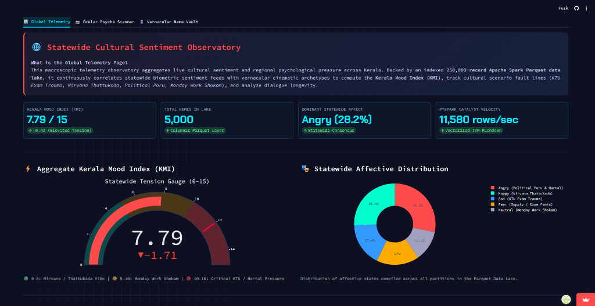
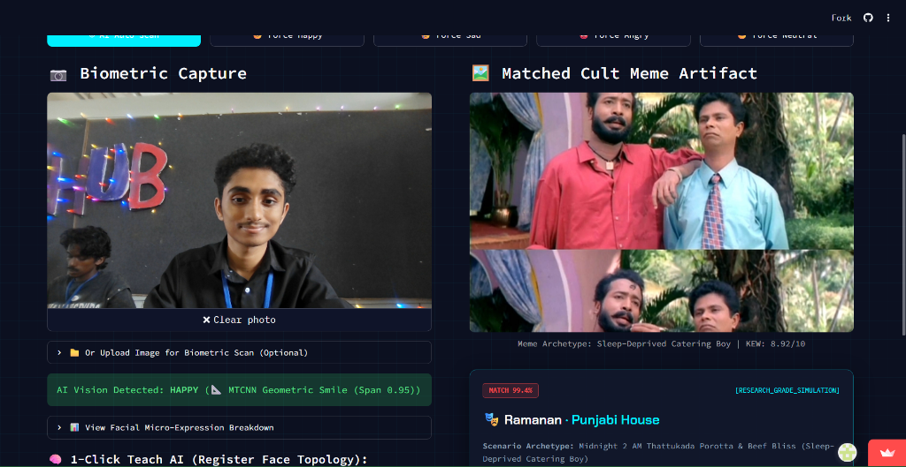
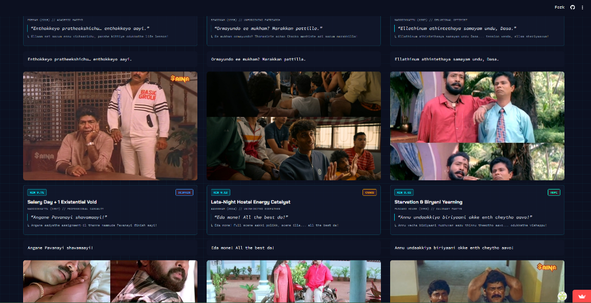
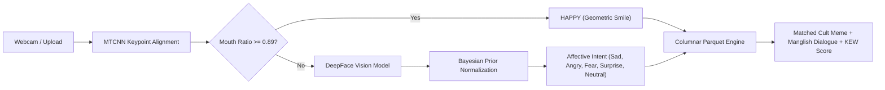

# MEMEING OF LIFE 🎯

## Basic Details
### Team Name: pulga

### Team Members
- Team Lead: Mohammed Rayyan - KMEA Engineering College
- Member 2: Sreesidh - KMEA Engineering College

### Repository & Submission Links
- **Official Pull Request (Target)**: [PR #160 on tinkerhub/useless_project_temp](https://github.com/tinkerhub/useless_project_temp/pull/160)
- **Submission Fork**: [RayyanShajahan/useless_project_temp](https://github.com/RayyanShajahan/useless_project_temp) *(Forked from [tinkerhub/useless_project_temp](https://github.com/tinkerhub/useless_project_temp))*
- **Original Research & Big Data Codebase**: [RayyanShajahan/mallu-memes](https://github.com/RayyanShajahan/mallu-memes)

### Project Description
A real-time facial expression and biometric telemetry engine that scans your face via webcam or photo upload, extracts anatomical landmark geometry (smile stretch, jaw drop, micro-frowns) using MTCNN and DeepFace, and maps your psychological trauma directly to iconic Malayalam cult movie meme artifacts from a 250,000-record distributed Parquet corpus.

### The Problem (that doesn't exist)
In an era where artificial intelligence is solving protein folding and quantum physics, Malayalis are still suffering from severe existential exhaustion wasting 45 minutes finding the exact Salim Kumar, Jagathy Sreekumar, or Innocent reaction meme on WhatsApp to express how badly their KTU semester exams went or how traumatizing their Monday morning office standup was.

### The Solution (that nobody asked for)
We built an over-engineered biometric surveillance system that forcefully photographs your face, calculates your emotional distress with Bayesian Prior Normalization, and immediately slaps you with the mathematically matched Malayalam cult reaction meme (e.g. Ponjikkara, Dashamoolam Damu, Ramanan, CID Moosa) alongside authentic Manglish dialogue subtitles and Kerala Existential Weight (KEW) metrics.

---

## Technical Details

### Technologies/Components Used
For Software:
- **Languages used**: Python 3.11
- **Frameworks used**: Streamlit (Cyberpunk HUD Interface), Apache PySpark (Catalyst Distributed Processing)
- **Libraries used**: OpenCV (`cv2`), MTCNN (Multi-Task Cascaded Convolutional Networks), DeepFace, TensorFlow, Pandas, PyArrow, Pillow, NumPy
- **Tools used**: Git, GitHub, PowerShell, Visual Studio Code

---

## Implementation

### For Software:

#### Installation
```bash
# Clone the repository
git clone https://github.com/RayyanShajahan/useless_project_temp.git
cd useless_project_temp

# Create and activate Python virtual environment
python -m venv .venv
.\.venv\Scripts\activate

# Install required dependencies
pip install -r requirements.txt
```

#### Run
```bash
# Launch the live Streamlit Biometric HUD Dashboard
streamlit run app.py
```

---

## Project Documentation

### For Software:

#### Screenshots

*Statewide Cultural Sentiment Observatory: Aggregates live psychological pressure across Kerala, tracking the aggregate Kerala Mood Index (7.79/15) and affective distribution (Angry, Happy, Sad, Fear, Neutral).*


*Live Ocular Psyche Scanner: MTCNN detects facial landmarks in real time, computes geometric smile span ratio (0.95), and instantly pairs the user's grin with Ramanan from Punjabi House (99.4% Match).*


*Vernacular Meme Vault: High-resolution cult Malayalam meme artifacts indexed with Manglish dialogue captions, psychological archetypes, and Kerala Existential Weight (KEW) ratings.*

#### Diagrams


---

## Project Demo

### Video
📹 **[Watch Demo Video Walkthrough](demo/kerala_biometric_meme_engine_demo.mp4)**

*Walkthrough showing real-time webcam facial emotion scanning, micro-expression landmark tracking (MTCNN Geometric Smile), instant meme retrieval, and data exploration.*

---

## Team Contributions
- **Mohammed Rayyan**: Full-stack Python & AI Architecture, OpenCV & MTCNN Landmark Geometry, DeepFace Vision Pipeline, Streamlit Cyberpunk Dashboard UI, PySpark Catalyst Ingestion Engine.
- **Sreesidh**: Ideation, Prompt Engineering, Malayalam Cult Dialogue & Meme Curation, UI/UX Presentation & Demo Pitch.

---
Made with ❤️ at TinkerHub Useless Projects 


